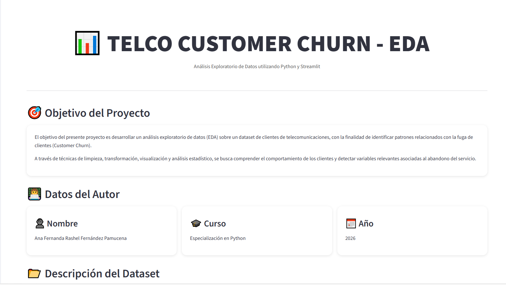
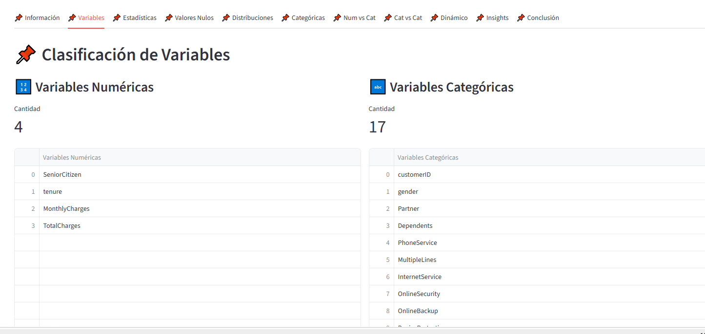
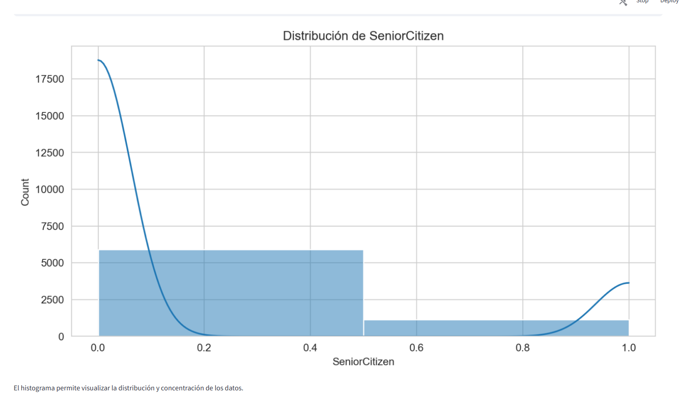
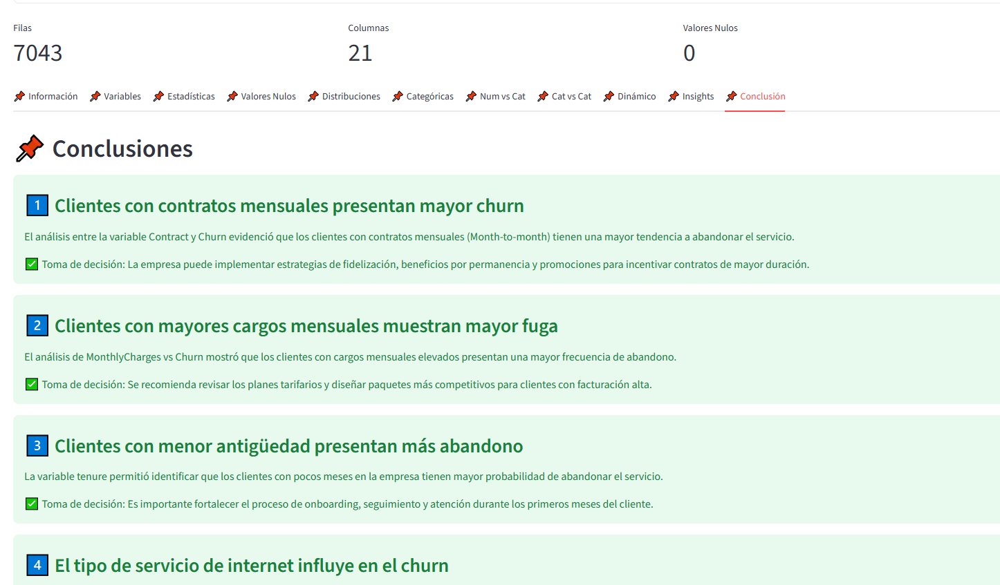

# MiAplicacionCaso2
# 📊 Telco Customer Churn - EDA Application

---

# 🚀 Descripción del Proyecto

**Telco Customer Churn - EDA Application** es una aplicación interactiva
desarrollada con **Python** y **Streamlit** para realizar un
**Análisis Exploratorio de Datos (EDA)** sobre clientes de telecomunicaciones.

La aplicación permite:

- Cargar datasets CSV dinámicamente
- Analizar variables numéricas y categóricas
- Identificar patrones asociados al churn
- Visualizar distribuciones y comparaciones
- Detectar valores nulos y problemas de calidad de datos
- Generar insights para la toma de decisiones

El objetivo principal NO es desarrollar modelos predictivos,
sino analizar y comprender el comportamiento de los clientes
a través de herramientas visuales y estadísticas.

---

# 📈 Funcionalidades Principales

✅ Carga interactiva de datasets CSV  
✅ Limpieza y transformación de datos  
✅ Estadísticas descriptivas  
✅ Clasificación automática de variables  
✅ Histogramas y gráficos categóricos  
✅ Análisis bivariado  
✅ Visualizaciones interactivas  
✅ Dashboard organizado con tabs y sidebar  
✅ Hallazgos clave orientados a negocio  

---

# 📷 Capturas de la Aplicación

## 🏠 Home

---

## 📊 Estadísticas Descriptivas

---

## 📈 Distribución de Variables

---

## 📌 Hallazgos Clave

---

# ⚙️ Tecnologías Utilizadas

- Python
- Streamlit
- Pandas
- NumPy
- Matplotlib
- Seaborn
